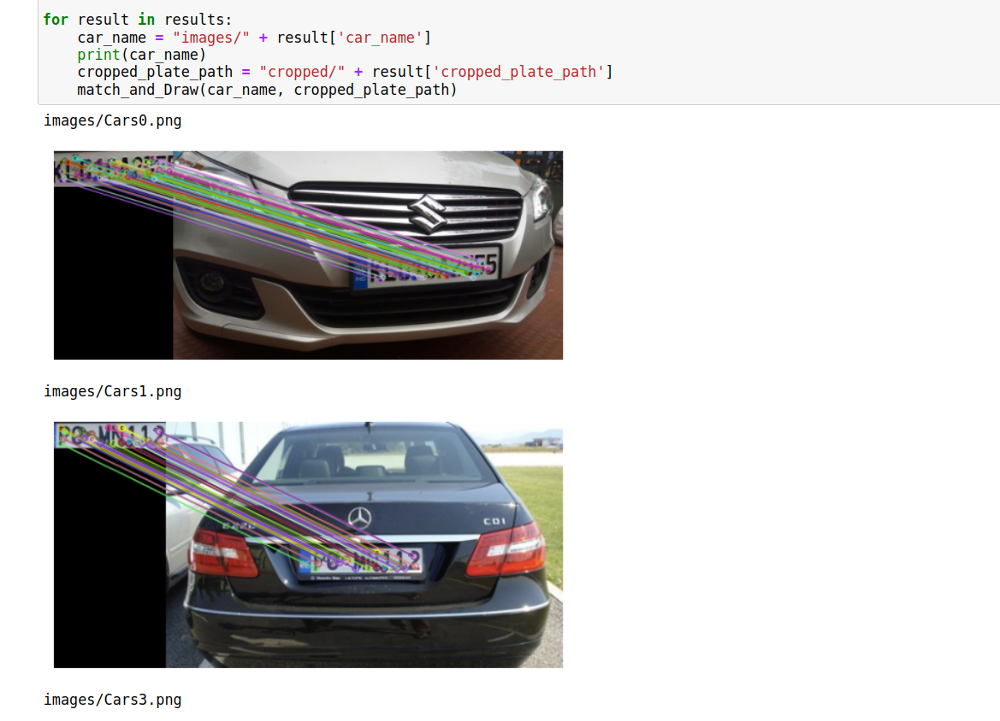
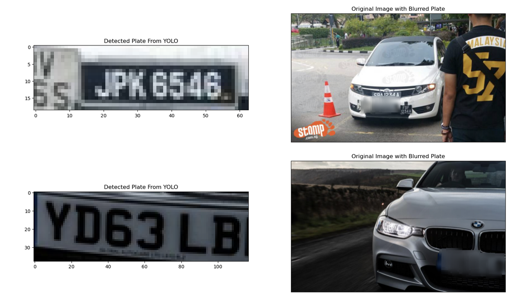
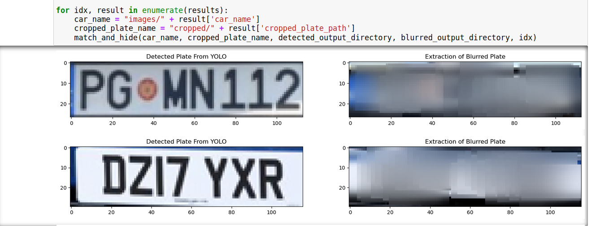
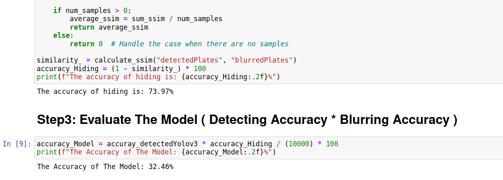

# Car-Plate-Anonymization-Yolov4
This project develops a car license plate anonymization system using YOLOv4 for plate detection, 
SIFT for feature processing, and blurring techniques to obscure plate information.

## Step 1: License Plate Detection and Cropping
Use YOLOv3 to detect license plates in the dataset images and crop the detected plate regions for further processing.

The accuracy of detecting: 

## Step 2: Plate Matching with SIFT
Apply SIFT algorithm to find and draw feature matches between the cropped license plate image and the original car image to precisely locate the plate position.
  

## step 3: Plate Blurring
Apply blurring techniques to the matched license plate regions in the original car images to anonymize the plate information.
  

## Step 4: Accuracy Evaluation
Compute the accuracy of the hiding process and evaluate the overall model performance for the anonymization system.
 
  

